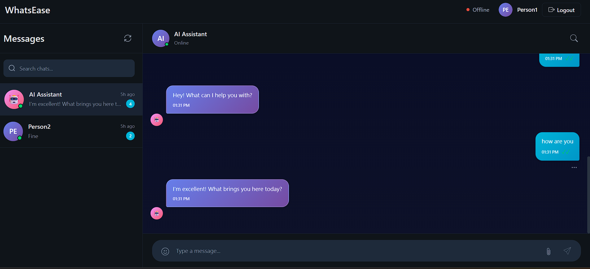

# 💬 WhatsEase Chat Application

A real-time chat application with AI bot integration, built with FastAPI (backend) and React (frontend). Features WebSocket-based instant messaging, JWT authentication, and PostgreSQL database.


## 🌟 Features

- ✅ **Real-time Messaging**: WebSocket-based instant communication
- ✅ **User Authentication**: Secure JWT-based authentication with bcrypt password hashing
- ✅ **AI Assistant Bot**: Automated responses 
- ✅ **Online Status**: Real-time user presence tracking
- ✅ **Message History**: Persistent message storage with read receipts
- ✅ **Modern UI**: Responsive React interface with Vite
- ✅ **RESTful API**: Comprehensive API with automatic documentation
- ✅ **Database ORM**: SQLAlchemy async ORM with PostgreSQL


## 📋 Table of Contents

- [Prerequisites](#-prerequisites)
- [Quick Start](#-quick-start)
- [Project Structure](#-project-structure)
- [API Documentation](#-api-documentation)
- [Configuration](#-configuration)
- [Deployment](#-deployment)
- [Development](#-development)
- [Troubleshooting](#-troubleshooting)
- [Contributing](#-contributing)
- [License](#-license)

## 📋 Prerequisites

- Python 3.8+
- Node.js 16+
- PostgreSQL 12+
- npm or yarn

## 🚀 Quick Start

### Backend Setup

1. **Navigate to Backend directory**
   ```bash
   cd Backend
   ```

2. **Create virtual environment**
   ```bash
   python -m venv venv
   
   # Windows
   venv\Scripts\activate
   
   # Linux/Mac
   source venv/bin/activate
   ```

3. **Install dependencies**
   ```bash
   pip install -r requirements.txt
   ```

4. **Configure environment variables**
   
   Create a `.env` file in `Backend/app/` directory:
   ```env
   # Application Settings
   APP_NAME=WhatsEase
   APP_VERSION=1.0.0
   DEBUG=True
   LOG_LEVEL=INFO
   LOG_FILE=app.log
   
   # PostgreSQL Configuration
   POSTGRES_USER=your_postgres_user
   POSTGRES_PASSWORD=your_postgres_password
   POSTGRES_HOST=localhost
   POSTGRES_PORT=5432
   POSTGRES_DB=whatsease_db
   
   # JWT Settings
   SECRET_KEY=your_secret_key_here_generate_with_openssl
   ALGORITHM=HS256
   ACCESS_TOKEN_EXPIRE_MINUTES=30
   
   # CORS Settings
   ALLOWED_ORIGINS=http://localhost:5173,http://localhost:3000
   ```

5. **Generate Secret Key** (optional but recommended)
   ```bash
   openssl rand -hex 32
   ```

6. **Initialize Database**
   
   Make sure PostgreSQL is running, then:
   ```bash
   # The database tables will be created automatically on first run
   python -m uvicorn app.main:app --reload
   ```

7. **Setup Test Users** (optional)
   ```bash
   python setup_test_users.py
   ```

8. **Run the Backend**
   ```bash
   uvicorn app.main:app --reload --host 0.0.0.0 --port 8000
   ```

   API will be available at: `http://localhost:8000`
   
   API Documentation: `http://localhost:8000/docs`

### Frontend Setup

1. **Navigate to Frontend directory**
   ```bash
   cd frontend
   ```

2. **Install dependencies**
   ```bash
   npm install
   ```

3. **Configure environment variables**
   
   Create a `.env` file in `frontend/` directory:
   ```env
   VITE_API_URL=http://localhost:8000
   VITE_WS_URL=ws://localhost:8000
   ```

4. **Run the Frontend**
   ```bash
   npm run dev
   ```

   Application will be available at: `http://localhost:5173`

## 📁 Project Structure

```
WhatsEase/
├── Backend/
│   ├── app/
│   │   ├── __init__.py
│   │   ├── main.py              # FastAPI application entry point
│   │   ├── config.py            # Configuration settings
│   │   ├── database.py          # Database connection & setup
│   │   ├── models/              # SQLAlchemy models
│   │   │   ├── user.py
│   │   │   └── message.py
│   │   ├── routers/             # API endpoints
│   │   │   ├── auth.py
│   │   │   ├── users.py
│   │   │   ├── messages.py
│   │   │   └── websocket.py
│   │   ├── schema/              # Pydantic schemas
│   │   ├── services/            # Business logic
│   │   └── utils/               # Utility functions
│   ├── requirements.txt
│   └── setup_test_users.py
│
└── frontend/
    ├── src/
    │   ├── App.jsx              # Main React component
    │   ├── main.jsx             # React entry point
    │   ├── components/          # React components
    │   ├── context/             # React context
    │   ├── services/            # API services
    │   ├── styles/              # CSS styles
    │   └── utils/               # Utility functions
    ├── public/
    ├── package.json
    └── vite.config.js
```

## 🔧 API Endpoints

### Authentication
- `POST /api/auth/register` - Register new user
- `POST /api/auth/login` - Login user
- `POST /api/auth/logout` - Logout user
- `GET /api/auth/me` - Get current user

### Users
- `GET /api/users` - Get all users
- `GET /api/users/{user_id}` - Get user by ID
- `PUT /api/users/{user_id}` - Update user
- `DELETE /api/users/{user_id}` - Delete user

### Messages
- `GET /api/messages` - Get messages
- `POST /api/messages` - Send message
- `GET /api/messages/{message_id}` - Get message by ID
- `DELETE /api/messages/{message_id}` - Delete message

### WebSocket
- `WS /ws/chat` - WebSocket connection for real-time messaging

### Health Checks
- `GET /` - Root endpoint
- `GET /health` - Health check with database status

## 🗄️ Database Schema

### Users Table
- `id` (Primary Key)
- `email` (Unique)
- `username`
- `full_name`
- `hashed_password`
- `is_online`
- `is_active`
- `bio`
- `avatar_url`
- `created_at`
- `updated_at`

### Messages Table
- `id` (Primary Key)
- `sender_id` (Foreign Key → Users)
- `receiver_id` (Foreign Key → Users)
- `content`
- `is_read`
- `created_at`
- `updated_at`

## 🤖 AI Bot

The application includes an AI assistant bot that is automatically created during database initialization:
- Email: `bot@whatsease.com`
- Username: `AI Assistant`
- Always online
- Cannot be used for login

## 🛠️ Development

### Running Tests
```bash
# Backend tests
cd Backend
pytest

# Frontend tests
cd frontend
npm test
```

### Code Style
```bash
# Backend (using black and flake8)
black app/
flake8 app/

# Frontend (using ESLint)
npm run lint
```

### Database Migrations
```bash
# Create migration
alembic revision --autogenerate -m "description"

# Apply migration
alembic upgrade head

# Rollback migration
alembic downgrade -1
```

## 📝 Configuration Files

### Backend Configuration ([`app/config.py`](Backend/app/config.py))
Manages all application settings using Pydantic BaseSettings with environment variable support.

### Database Configuration ([`app/database.py`](Backend/app/database.py))
- PostgreSQL connection with asyncpg
- SQLAlchemy async ORM
- Connection pooling (10 base connections, 20 overflow)
- Automatic table creation via [`init_db`](Backend/app/database.py)

### Main Application ([`app/main.py`](Backend/app/main.py))
- FastAPI application with lifespan management
- CORS middleware configuration
- Router registration
- Health check endpoints

## 🔒 Security

- **Password Hashing**: Using bcrypt
- **JWT Tokens**: Secure authentication
- **CORS**: Configured for specific origins
- **Environment Variables**: Sensitive data not hardcoded
- **SQL Injection Protection**: Using SQLAlchemy ORM

## 🐛 Troubleshooting

### Database Connection Issues
- Verify PostgreSQL is running: `sudo systemctl status postgresql`
- Check credentials in `.env` file
- Ensure database exists: `createdb whatsease_db`

### Port Already in Use
```bash
# Find process using port 8000
lsof -i :8000

# Kill process
kill -9 <PID>
```

### Module Not Found
```bash
# Reinstall dependencies
pip install -r requirements.txt --force-reinstall
```

## 📦 Deployment

### Backend Deployment (Example with Docker)
```dockerfile
FROM python:3.11-slim
WORKDIR /app
COPY requirements.txt .
RUN pip install --no-cache-dir -r requirements.txt
COPY app/ ./app/
CMD ["uvicorn", "app.main:app", "--host", "0.0.0.0", "--port", "8000"]
```

### Frontend Deployment
```bash
npm run build
# Deploy the 'dist' folder to your hosting service
```

## 🤝 Contributing

1. Fork the repository
2. Create your feature branch (`git checkout -b feature/AmazingFeature`)
3. Commit your changes (`git commit -m 'Add some AmazingFeature'`)
4. Push to the branch (`git push origin feature/AmazingFeature`)
5. Open a Pull Request

## 📄 License

This project is licensed under the MIT License.

## 👥 Authors

- Shasank Pandey - Initial work

## 🙏 Acknowledgments

- FastAPI documentation
- React documentation
- SQLAlchemy documentation
- PostgreSQL community

